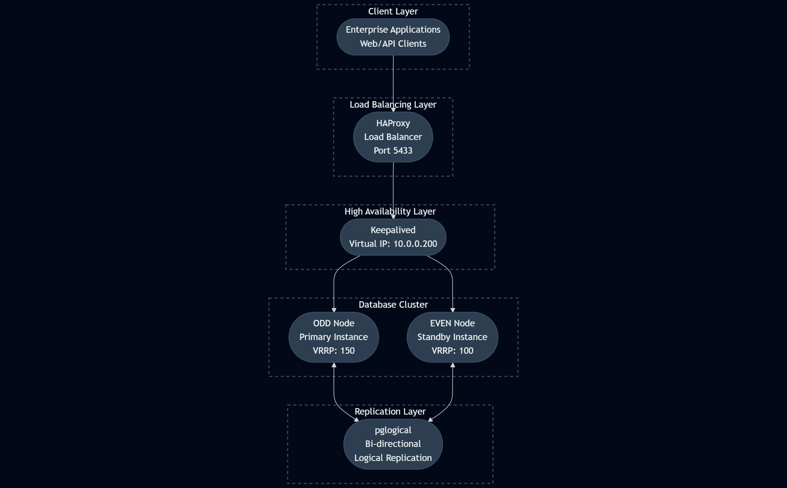

<div align="center">
  
</div>

An Ansible playbook to deploy a PostgreSQL 16 active-active cluster with high availability using pglogical, HAProxy, and Keepalived.
## Table of Contents

| Section | Description |
|-------|-------------|
| [Overview](#overview) | Project purpose, scope, and objectives |
| [Features](#features) | Core capabilities and supported functionality |
| [Architecture](#architecture) | System design, components, and data flow |
| [Prerequisites](#prerequisites) | Required software, access, and dependencies |
| [Ansible Setup](#ansible-setup) | Automation framework configuration and roles |
| [Installation](#installation) | Deployment and initial setup procedures |
| [Configuration](#configuration) | Environment-specific settings and customization |
| [Usage](#usage) | Operational guidelines and examples |
| [Services](#services) | Managed services and integrations |
| [Maintenance](#maintenance) | Operational tasks and lifecycle management |
| [Troubleshooting](#troubleshooting) | Diagnostics, common issues, and resolutions |
| [Security](#security) | Authentication, authorization, and hardening practices |
| [Backup and Recovery](#backup-and-recovery) | Data protection, retention, and restoration strategies |
| [Scaling](#scaling) | Performance optimization and capacity planning |
| [License](#license) | Legal terms and usage rights |


## Overview

This playbook deploys a PostgreSQL 16 active-active cluster designed for high availability and fault tolerance. It implements bi-directional logical replication using pglogical, with load balancing and failover capabilities.

## Features

| Feature Area | Description |
|-------------|-------------|
| Active-Active PostgreSQL Cluster | Two PostgreSQL 16 nodes configured for active-active replication |
| Logical Replication | Logical replication implemented using pglogical for efficient data synchronization |
| High Availability | Automatic failover with Virtual IP (VIP) Management (*disabled ) |
| High Availability | Automatic failover with DNS-based routing |
| Load Balancing | HAProxy-based connection load balancing across nodes |
| VIP Management | keepalived for seamless virtual IP failover (*disabled)|
| DNS Routing | DNS-based routing for seamless failover |
| Configuration Preservation | Appends configuration settings without overwriting existing PostgreSQL configurations |
| Network Security | Secure client authentication configured via pg_hba.conf |
| Performance Tuning | Optimized PostgreSQL settings for replication and workload performance |
| System Optimization | Kernel and OS-level parameter tuning for high availability workloads |
| Monitoring Readiness | Pre-configured for integration with enterprise monitoring solutions |


## Architecture
<p align="left">
  
</p>

The architecture consists of:

- **Two PostgreSQL Nodes**: Primary and secondary nodes with bi-directional replication
- **DNS Routing**: DNS-based routing for seamless failover
- **HAProxy**: Load balancer distributing connections to PostgreSQL nodes
- **pglogical**: Logical replication engine for active-active setup
- **Fencing**: Prevents split-brain scenarios
- **Foreign Data Wrappers**: For cross-database access

### Node Roles
- **ODD Node**: Primary node for DNS routing
- **EVEN Node**: Secondary node for failover

## Prerequisites

### Infrastructure Requirements
- 2 Ubuntu 20.04+ servers (minimum 4GB RAM, 2 CPU each)
- Network connectivity between nodes
- Dedicated network interface for VIP management
- SSH access to target servers

### Software Requirements
- Ansible 2.9+
- Python 3.6+ on target nodes
- Sudo access on target nodes

### Network Requirements
- Static IP addresses for each node
- DNS record for application access
- Firewall rules allowing PostgreSQL (5432) and HAProxy (5433) traffic

## Ansible Setup

### On Control Machine (Your Computer)

1. Install Python and pip (if not already installed):
   ```bash
   # On Ubuntu/Debian
   sudo apt update
   sudo apt install python3 python3-pip

   # On CentOS/RHEL
   sudo yum install python3 python3-pip
   ```

2. Install Ansible:
   ```bash
   pip3 install ansible
   ```

3. Verify installation:
   ```bash
   ansible --version
   ```

4. Generate SSH key (if you don't have one):
   ```bash
   ssh-keygen -t rsa -b 4096 -C "ansible@control"
   ```
5. Copy SSH key to target servers:
   ```bash
   ssh-copy-id ubuntu@<NODE_IP_ADDRESS>
   ```
   
   Repeat for each target server.

6. Test SSH connectivity:
   ```bash
   ssh ubuntu@<NODE_IP_ADDRESS>
   ```

## Target Server Preparation

### On each target server:
1. Ensure Python is installed:
   ```bash
   sudo apt update
   sudo apt install python3
   ```

2. Create a sudo user (if needed):
   ```bash
   sudo adduser ansible-user
   sudo usermod -aG sudo ansible-user
   ```
3. Ensure sudo doesn't require password for Ansible (optional but recommended):
   ```bash
   echo 'ansible-user ALL=(ALL) NOPASSWD:ALL' | sudo tee /etc/sudoers.d/ansible
   ```
## Installation

1. Clone the repository:
   ```bash
   git clone <repository-url>
   cd pg-active-active-ansible
   ```
2. Update the inventory file with your server details:
   ```bash
   vim inventory/prod.ini
   ```
3. Review and customize global variables:
   ```bash
   vim group_vars/all.yml
   ```
4. Test connectivity:
   ```bash
   ansible -i inventory/prod.ini postgres -m ping
   ```
5. Run the playbook:
   ```bash
   ansible-playbook -i inventory/prod.ini site.yml
   ```
## Configuration

### Global Variables (`group_vars/all.yml`)
```yaml
timezone: Asia/Kolkata

sysctl_params:
  net.ipv4.ip_nonlocal_bind: 1
  net.ipv4.conf.all.arp_ignore: 1
  net.ipv4.conf.all.arp_announce: 2

pg_conf:
  wal_level: logical
  max_replication_slots: 10
  max_wal_senders: 10
  max_logical_replication_workers: 8
  shared_preload_libraries: pglogical
  synchronous_commit: off
  wal_compression: on
  checkpoint_timeout: 15min
  checkpoint_completion_target: 0.9
  listen_addresses: "*"
  tcp_keepalives_idle: 30
  tcp_keepalives_interval: 10
  tcp_keepalives_count: 5
```

### Inventory Configuration (`inventory/prod.ini`)

```ini
[odd]
btsdbact01 ansible_host=10.0.0.145 node_role=ODD vrrp_priority=150

[even]
btsdbact02 ansible_host=10.0.0.155 node_role=EVEN vrrp_priority=100

[postgres:children]
odd
even

[all:vars]
ansible_user=ubuntu
ansible_python_interpreter=/usr/bin/python3

vip_ip=10.0.0.200
pg_port=5432
haproxy_port=5433
net_iface=enp0s5

pg_version=16
pg_data=/var/lib/postgresql/16/main
pg_wal=/var/lib/postgresql_wal

db_name=db_1
repl_user=repluser
repl_password=Pass123
```

### Role Descriptions
- **common**: Base system setup, timezone, sysctl parameters
- **postgres**: PostgreSQL installation, configuration, and service management
- **pglogical**: Logical replication setup and configuration
- **ownership**: Database ownership and permission management
- **fdw**: Foreign Data Wrapper configuration
- **haproxy**: Load balancer setup and configuration
- **dns-routing**: DNS-based routing for application connections
- **health-checks**: Health checks for failover detection

## Usage

### Initial Setup
After deployment, the cluster will be ready for use. Connect to the database using the DNS name:

```bash
psql -h {{ db_dns_name }} -U <USER> -d <DATABASE>
```
### Connection Information
- **Direct Node Access**: Port 5432 on individual nodes
- **Load Balanced Access**: Port 5433 via HAProxy
- **Application Connection**: Use DNS name for transparent failover

### Testing Failover
1. Check DNS resolution for {{ db_dns_name }}
2. Stop PostgreSQL on active node: `sudo systemctl stop postgresql`
3. Verify traffic routes to other node
4. Restart PostgreSQL: `sudo systemctl start postgresql`

## Services
### PostgreSQL
- **Port**: 5432
- **Service**: postgresql
- **Data Directory**: `/var/lib/postgresql/16/main`
- **Config Files**: `/etc/postgresql/16/main/`

### HAProxy
- **Port**: 5433
- **Service**: haproxy
- **Config**: `/etc/haproxy/haproxy.cfg`
- **Stats**: Available at `/haproxy-stats` endpoint

### DNS Routing
- **Protocol**: DNS
- **Service**: DNS resolver
- **Routing**: Application DNS name
- **Failover**: DNS-based failover mechanism

## Maintenance

### Monitoring Replication

Check replication status on PostgreSQL nodes:
```sql
SELECT * FROM pglogical.show_subscription_status();
SELECT * FROM pg_stat_replication;
```
### Log Files
- **PostgreSQL**: `/var/log/postgresql/postgresql-16-main.log`
- **HAProxy**: `/var/log/haproxy.log`
- **Keepalived**: `/var/log/syslog` (search for keepalived)

### Backup Strategy
- Logical backups using pg_dump/pglogical
- WAL archiving enabled
- Regular configuration file backups

### Health Checks
- **Service status**: `systemctl status postgresql haproxy keepalived`
- **Replication lag**: Monitor replication delay
- **Connection pooling**: Check HAProxy statistics

## Troubleshooting

### Common Issues

#### VIP Not Moving
- Check Keepalived logs: `journalctl -u keepalived -f`
- Verify network connectivity between nodes
- Check firewall rules for VRRP traffic

#### Replication Problems
- Check pglogical subscription status
- Verify network connectivity between nodes
- Check authentication settings in pg_hba.conf

#### HAProxy Issues
- Check HAProxy logs for connection errors
- Verify backend server status
- Review HAProxy configuration

### Diagnostic Commands
```bash
# Check all services
sudo systemctl status postgresql haproxy keepalived

# Check VIP status
ip addr show <network_interface>

# PostgreSQL health
sudo -u postgres psql -c "SELECT pg_is_in_recovery();"

# Replication status
sudo -u postgres psql -c "SELECT * FROM pg_stat_replication;"
```

## Security

### Authentication
- SCRAM-SHA-256 authentication for application connections
- Replication user with restricted access
- Network-based access controls in pg_hba.conf

### Network Security
- Restrictive pg_hba.conf configuration
- Firewall rules limiting access to trusted networks
- Encrypted connections recommended

### Best Practices
- Change default passwords
- Regular security updates
- Monitor access logs
- Implement connection limits

## Backup and Recovery

### Backup Strategy
- Logical backups using pg_dump
- WAL archiving for point-in-time recovery
- Configuration file backups

### Recovery Process

1. Restore from logical backup
2. Apply WAL logs if needed
3. Reconfigure replication

## Scaling

### Horizontal Scaling

- Add additional read replicas
- Adjust HAProxy configuration
- Update monitoring systems

### Vertical Scaling

- Increase server resources
- Adjust PostgreSQL configuration accordingly
- Test performance after changes

## License

This project is licensed under the MIT License - see the [LICENSE](LICENSE) file for details.

<br><br><div align="center"><em>Made with ❤️ for the PostgreSQL Community ⭐ Star this repo if you found it helpful!</em></div>
